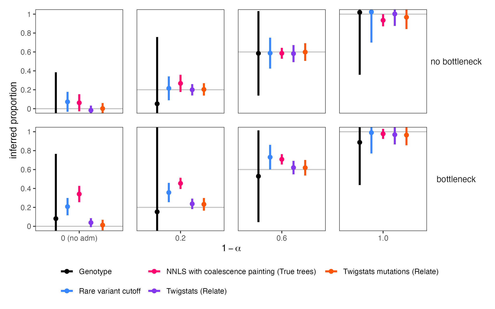
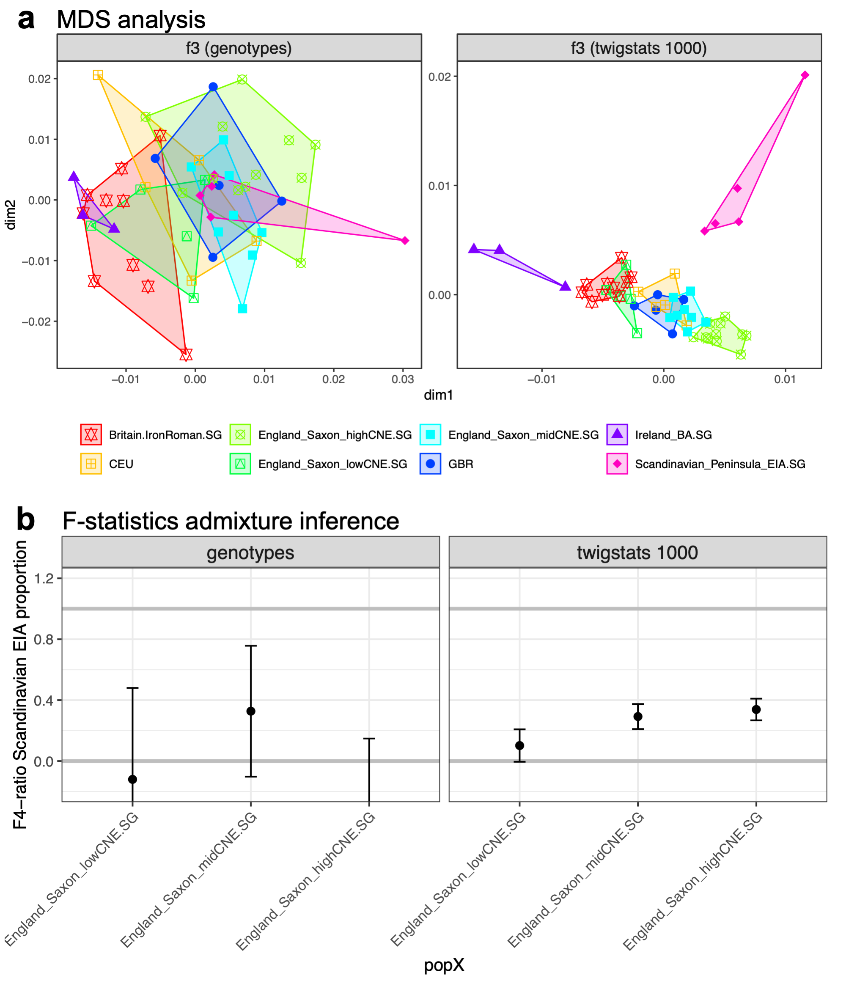

# Twigstats

Boost f-statitics power using genealogies. Compatible with [admixtools2](https://uqrmaie1.github.io/admixtools/index.html).<br/>
Full documentation at [leospeidel.github.io/twigstats](https://leospeidel.github.io/twigstats).<br/>
Each function is described on this page: [leospeidel.github.io/twigstats/reference](https://leospeidel.github.io/twigstats/reference).<br/>
Please see [zenodo.org/records/13880459](https://zenodo.org/records/13880459) for scripts to run <b>Relate</b> and <b>Twigstats</b> on your data.

## Installation

Please install this package by running the following command in R:
```R
library(remotes)
install_github("leospeidel/twigstats")
```
or
```R
install.packages('twigstats', repos = c('https://leospeidel.r-universe.dev', 'https://cloud.r-project.org'))
```


Alternatively, clone this directory (https://github.com/leospeidel/twigstats) and then in R type
```R
library(devtools)
install()
```

Please make sure to have an up-to-date R version (>=3.6.0) and C/C++ compiler (e.g., >=GCC v8) loaded in your environment.
If you encounter issues, it can help to create a clean R library. Assuming you place this in your home directory, this is done using
```
mkdir ~/R_libs_for_twigstats/
export R_LIBS_USER="~/R_libs_for_twigstats/"
```
Now, all required R packages will be installed into this fresh R library.

## Basic Usage

<ul>
<li>Please see [leospeidel.github.io/twigstats/articles/basic-usage.html](https://leospeidel.github.io/twigstats/articles/basic-usage.html).</li>
<li>For a small real data example see [leospeidel.github.io/twigstats/articles/real-data-example.html](https://leospeidel.github.io/twigstats/articles/real-data-example.html).</li>
<li>We also provide a detailed example, including scripts that can be repurposed for other datasets, at [zenodo.org/records/13880459](https://zenodo.org/records/13880459). We demonstrate how to prepare the data, run Relate, run Twigstats, infer admixture proportions, and plot an MDS.</li>
</ul>

## Simulations

<center>
{#id .class width=600px height=300px}
</center>

We simulate five populations named PI, PO, P1, P2, and PX, as described in our paper (Speidel et al, 2024). In this simulation PX is admixed between P1 and P2 50 generations ago and these source groups split 250 generations ago. 

The proportion is constrained by a ratio of two f4-statistics f4(PO, PI, PX, P1)/f4(PO, PI, P2, P1). We compute these f-statistics on the genotypes, as conventional, and using Twigstats choosing a cutoff time of 500 generations. We additional compare against a version where we compute f-statistics on variants ascertained using a rare-variant cutoff of 5% MAF, and we compare against an idealised 'chromosome painting' approach. 

We find that admixture proportions are inferred accurately and without bias using Twigstats.

## Real data

<center>
{#id .class width=600px height=300px}
</center>

We provide a detailed example data set, including ancient genomes from Britain, Ireland, and Scandinavia. We plot an MDS and compute admixture proportions in 'Anglo-Saxon' indiviuals in Britain using an f4-ratio statistic. For more details, please see [zenodo.org/records/13880459](https://zenodo.org/records/13880459).

